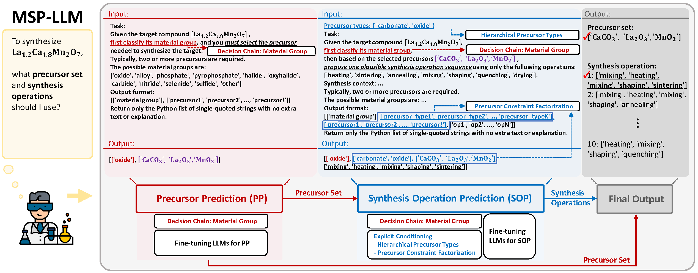

# MSP-LLM: A Unified Large Language Model Framework for Complete Material Synthesis Planning
The offical source code for MSP-LLM: A Unified Large Language Model Framework for Complete Material Synthesis Planning.
 
 
## Overview
Material synthesis planning (MSP) remains a fundamental and underexplored bottleneck in AI-driven materials discovery, as it requires not only identifying suitable precursor materials but also designing coherent sequences of synthesis operations to realize a target material. Although several
AI-based approaches have been proposed to address isolated subtasks of MSP, a unified methodology for solving the entire MSP task has yet to
be established. We propose **MSP-LLM**, a unified LLM-based framework that formulates MSP as a structured process composed of two constituent subproblems: precursor prediction (PP) and synthesis operation prediction (SOP). Our approach introduces a discrete material class as an intermediate decision variable that organizes both tasks into a chemically consistent decision chain. For OP, we further incorporate hierarchical precursor types as synthesis-relevant inductive biases and employ an explicit conditioning strategy that preserves precursor-related information in the autoregressive decoding state. Extensive experiments show that **MSP-LLM** consistently outperforms existing methods on both PP and SOP, as well as on the complete MSP task, demonstrating an effective and scalable framework for MSP that can accelerate real-world materials discovery.

## Overall Architecture of MSP-LLM

## Environment Setup

You can find the required packages in `env.yml`.

---

## Dataset

For **Precursor Prediction (PP)**, use:

`train_pp_ver1.jsonl`, `valid_pp_ver1.jsonl`, `test_pp_ver1.jsonl`

For **Synthesis Operation Prediction (SOP)**, use:

`train_sop_ver1.jsonl`, `valid_sop_ver1.jsonl`, `test_sop_ver1.jsonl`

If you want to generate these datasets, use:

`mk_dataset_pp_sop.py` with the following files:

`train_dataset_ver1.json`, `valid_dataset_ver1.json`, `test_dataset_ver1.json`

To generate the dataset for the complete MSP task using predicted precursors from the PP task, use:

`mk_dataset_msp.py`

---

## Finetuning and Inference

For finetuning, use:

`finetuning_llama.py`, `finetuning_qwen.py`

For inference, use:

`inference_llama.py`, `inference_qwen.py`

---

## Shell Scripts

### Precursor Prediction (PP)

- `finetuning_pp.sh`: Finetuning script for PP models  
- `inference_pp.sh`: Inference script for finetuned PP models  

### Synthesis Operation Prediction (SOP)

- `finetuning_sop.sh`: Finetuning script for SOP models  
- `inference_sop.sh`: Inference script for finetuned SOP models  

---

## Evaluation

We provide inference outputs for each task (PP, SOP, and complete MSP) in the `preds` folder.

You can reproduce the main results reported in the paper using:

`evaluate.py`

You may also retrain the models and generate new inference outputs for evaluation.

